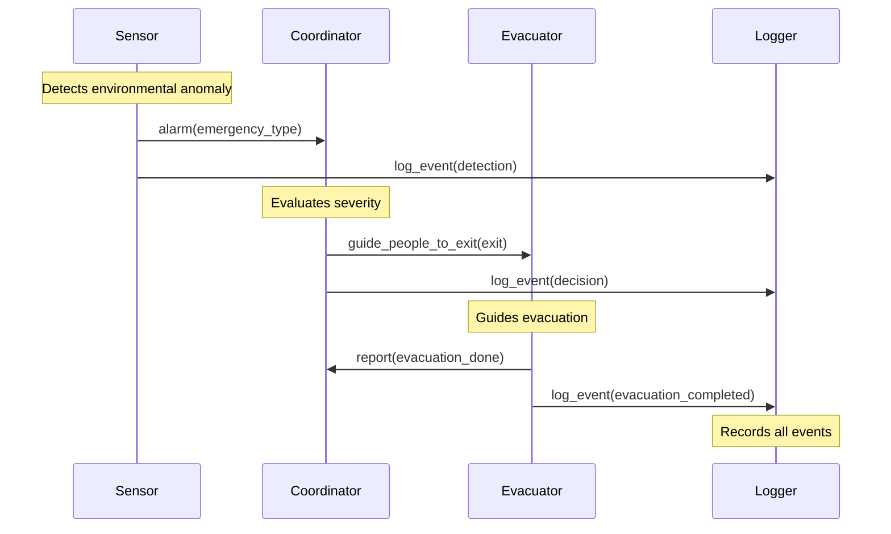

```mermaid
sequenceDiagram
    participant S as Sensor
    participant C as Coordinator
    participant E as Evacuator
    participant L as Logger

    Note over S: Detects environmental anomaly
    S->>C: alarm(emergency_type)
    S->>L: log_event(detection)
    
    Note over C: Evaluates severity
    C->>E: guide_people_to_exit(exit)
    C->>L: log_event(decision)
    
    Note over E: Guides evacuation
    E->>C: report(evacuation_done)
    E->>L: log_event(evacuation_completed)
    
    Note over L: Records all events
``` 